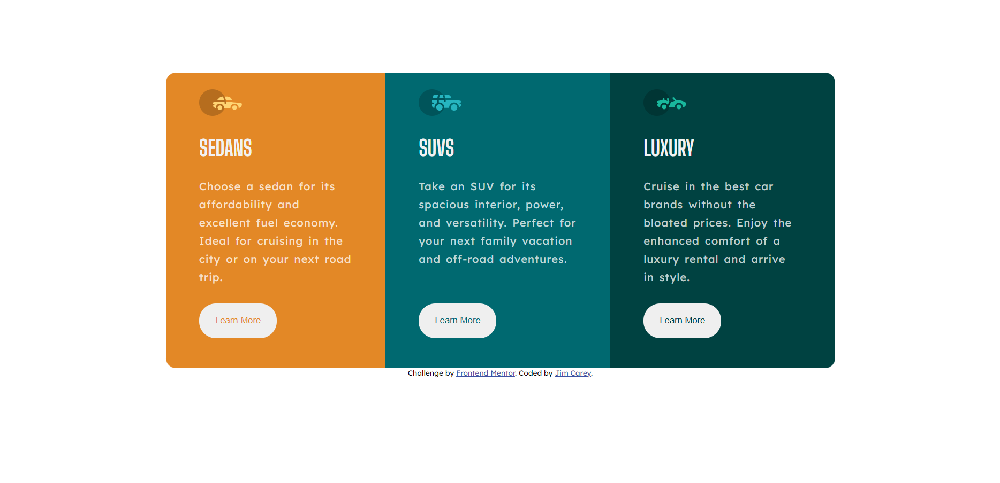

# Frontend Mentor - 3-column preview card component solution

This is a solution to the [3-column preview card component challenge on Frontend Mentor](https://www.frontendmentor.io/challenges/3column-preview-card-component-pH92eAR2-). Frontend Mentor challenges help you improve your coding skills by building realistic projects. 

## Table of contents

- [Overview](#overview)
  - [The challenge](#the-challenge)
  - [Screenshot](#screenshot)
  - [Links](#links)
- [My process](#my-process)
  - [Built with](#built-with)
  - [What I learned](#what-i-learned)
  - [Continued development](#continued-development)
  - [Useful resources](#useful-resources)
- [Author](#author)
- [Acknowledgments](#acknowledgments)

**Note: Delete this note and update the table of contents based on what sections you keep.**

## Overview

### The challenge

Users should be able to:

- View the optimal layout depending on their device's screen size
- See hover states for interactive elements

### Screenshot

### Links

- Live Site URL: [Add live site URL here](https://your-live-site-url.com)

## My process

### Built with

- Semantic HTML5 markup
- CSS custom properties
- Flexbox
- Mobile-first workflow

### What I learned

This project helped-me a lot with two important topics of web develepment, the first, wich i was struggling a lot, was media queries and resposive design, after this project my confidence grow, because i was abble to do it quite nice, and with no stress. The second topic tha helped me was the mobile-first work flow, this was my first experience building this way, and i liked.

### Continued development

I think that i still have a lot to learn in CSS, there's a lot of content that is not teached in basics courses, i could use CSS grid to get more confidence, so i will work on that...

### Useful resources

- [Web Dev Simplified Positions video](https://www.youtube.com/watch?v=jx5jmI0UlXU) - This helped me to understand how the positions values works finally.

## Author

- Frontend Mentor - [@JimCarey08](https://www.frontendmentor.io/profile/JimCarey08)
- Twitter - [@LucasViCoisas](https://twitter.com/LucasViCoisas)

## Acknowledgments

My tip for who is beggining just like me is: practice.
When you are tired and procrastinating, practice more.
Sometimes you are tired to finish the project that you started, go and do it, maybe you concludes with 5 lines of code....
